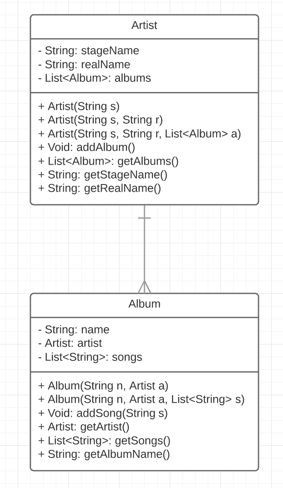
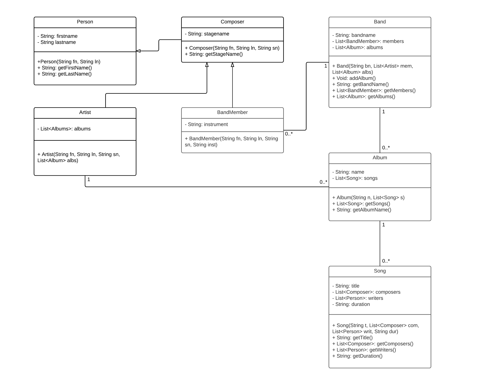
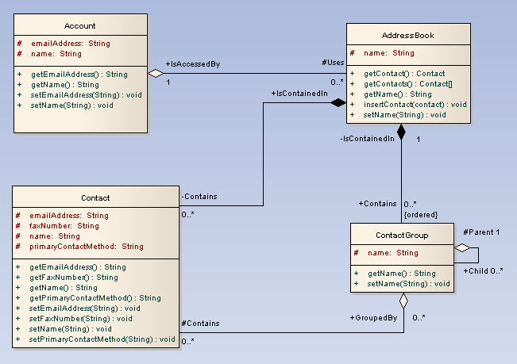

# APOSTILA SQL

# Diagrama de Entidade Relacionamento (DER)

## Entidades:

- Tabelas possui atributos, que são basicamente colunas.
- PK = Primary Key, Identificador de cada item.
- FK = Foreign Key, Referencia outra coluna em outra tabela

## Relacionamento de Entidades:

- **OneToOne**:

- **OneToMany**:

- **ManyToMany**:

# Referências:
[https://www.lucidchart.com/pages/pt/o-que-e-diagrama-entidade-relacionamento](O que é Diagrama Entidade Relacionamento)